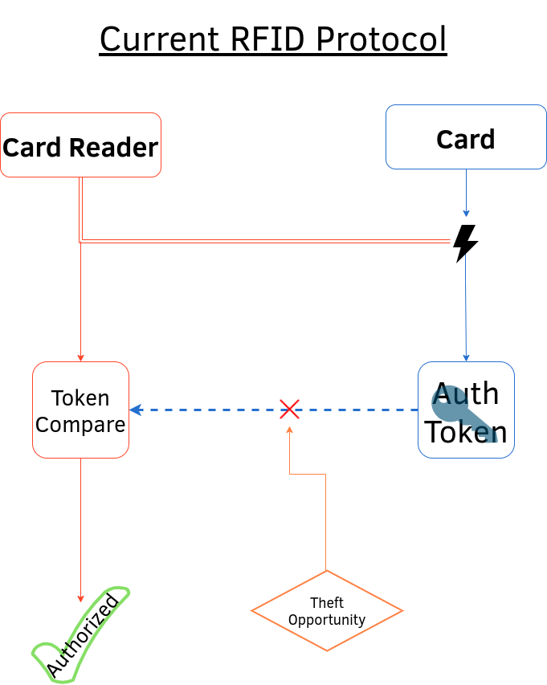
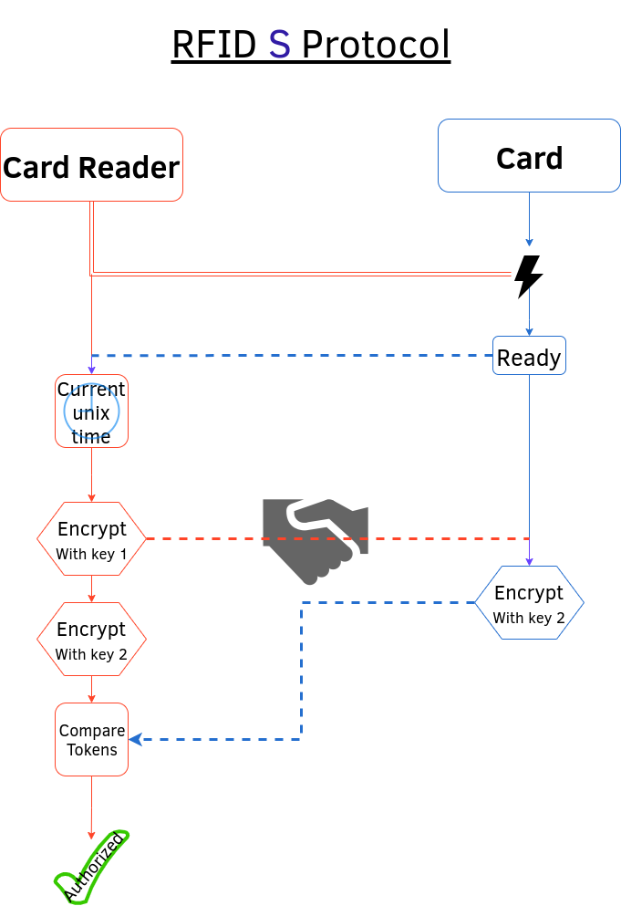
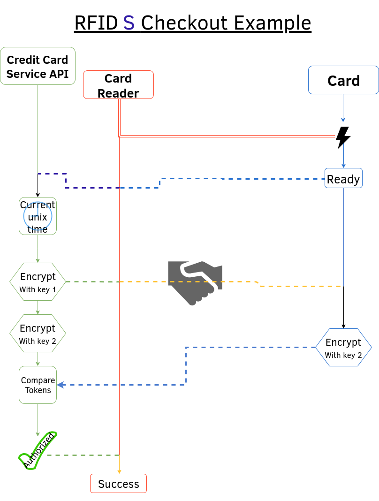

### RFID-S is to RFID what HTTPS is to HTTP&mdash; a more secure rendition of an existing protocol.
---
### RFID currently works by sending an authentication token over radio frequency. Unfortunately, this leaves that token vulnerable to being "skimmed" by malicious scanners.

> 

###  RFID-S, however, generates a one-time-use code using an encryption key where the scanner sends a random string of bytes to the client, both the client and scanner encrypt that string with the same token, and the client sends it back to the scanner to compare and authenticate. This is far more secure than RFID because no static code or encryption key is sent over RF to be stolen.

> 

###  Besides for classical RFID applications such as building-access ID cards, this method can also be applied to credit card checkout as a means of authorizing purchases.

> 

Necessary Materials for barebones operation
---
## Scanner:
- Microprocessor
- EEPROM
- RF transmitter
- RF receiver
- Induction emission coil (to power the card/client)

## Card/Client:
- Microprocessor
- RF transmitter
- RF receiver
- EEPROM
- Induction reception coil

Pins
---
- RX: 11
- TX: 12

---
##### *RFID-S Is originally written in Arduino but is a general concept that can be applied to any lanuage and use-case*
